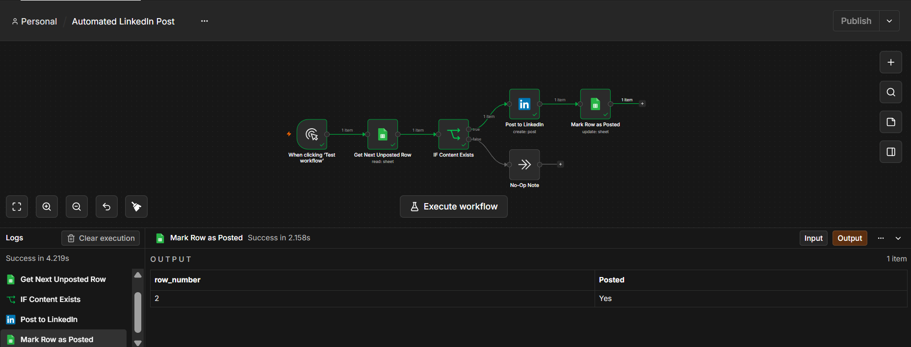
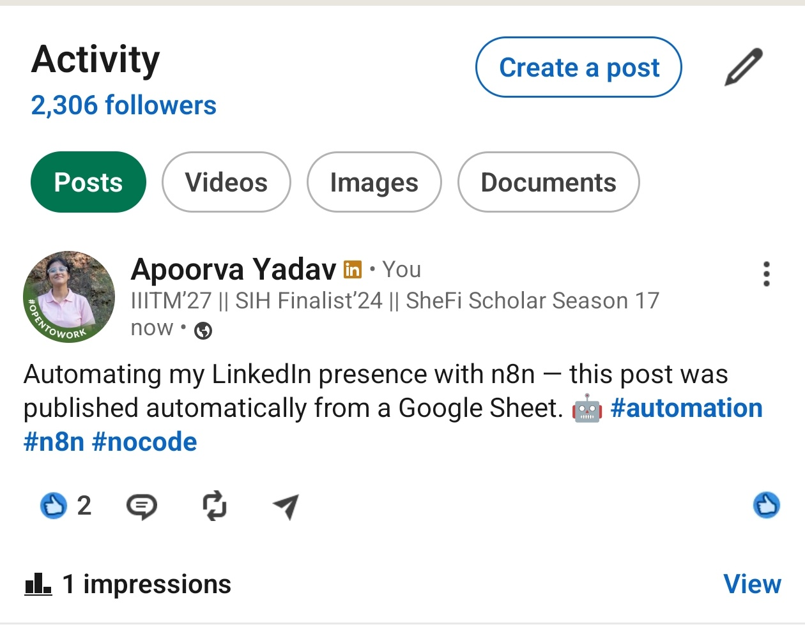

# Automated LinkedIn Post (n8n)

An n8n workflow that automatically posts to LinkedIn from a Google Sheets content queue.

## How it works

1. Trigger: runs on a schedule (or manual trigger for testing)
2. Get Next Unposted Row: reads a Google Sheet, finds the first row where `Posted = No`
3. IF Content Exists: skips if there's no text to post
4. Post to LinkedIn: posts the text to your LinkedIn profile
5. Mark Row as Posted: updates that row's `Posted` column to `Yes` so it isn't reposted

## Setup

### 1. Google Sheet

Create a sheet with these columns:

| PostText | Posted |
|---|---|
| Excited to share our new product launch! | No |
| Another post idea here | No |

### 2. Google Sheets credential (n8n)

1. Create a Google Cloud project, enable the Google Sheets API and Google Drive API
2. Create an OAuth Client ID (Web application) and add n8n's redirect URI
3. In n8n: create a new Google Sheets OAuth2 credential and connect your account

### 3. LinkedIn credential (n8n)

1. Create a LinkedIn Developer App at [developer.linkedin.com](https://developer.linkedin.com) with the `w_member_social` scope
2. In n8n: create a new LinkedIn OAuth2 credential and connect your account

### 4. Import the workflow

1. In n8n: Workflows > Import from File > select `linkedin-auto-post.json`
2. Update the placeholders:
   * `YOUR_GOOGLE_SHEET_URL` (in both Google Sheets nodes): your actual sheet URL
   * `YOUR_LINKEDIN_PERSON_URN` (in the LinkedIn node): your LinkedIn person URN
   * Credential dropdowns: point them at the credentials you created above
3. Swap the manual trigger for a Schedule Trigger if you want this to run automatically

## Proof it works

## Notes

LinkedIn's API requires images to be uploaded via a separate "register upload" call before referencing them. The n8n LinkedIn node itself handles this automatically for image posts. Rate limits apply, so don't schedule this to post too frequently.
